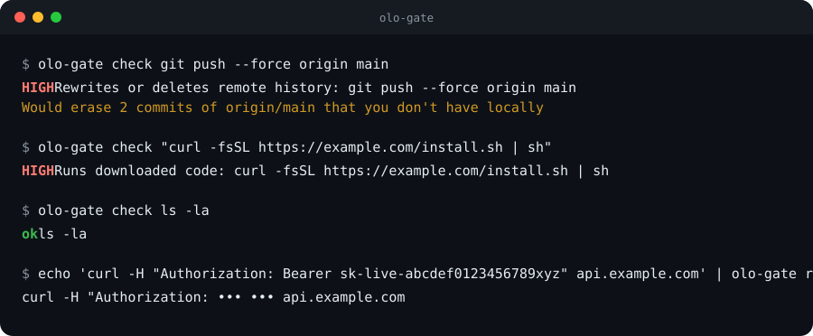
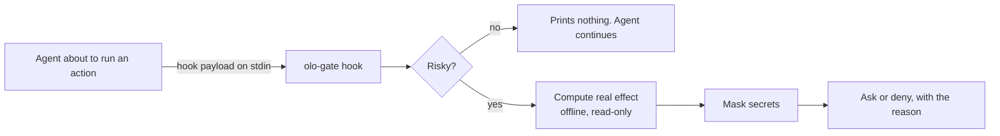

<div align="center">

# olo-gate

**A tiny guard for AI coding agents.**<br>
It asks before `git push --force`, `rm -rf`, deploys and other irreversible actions, and shows what they would *really* do.

[](https://github.com/faustodariopenamondragon-web/olo-gate/actions/workflows/ci.yml)
[](LICENSE)


Works with **Claude Code** · Cursor · Codex · Gemini CLI

</div>

<p align="center"></p>

## Why

Coding agents now run for minutes or hours while you are somewhere else. Most of what they do is fine.
A few things are not: a force push over your team's branch, `rm -rf` on the wrong folder, a `curl | sh`,
a deploy to production, an edit to `~/.ssh` or to the agent's own permissions.

Asking the model to be careful is not a control. **olo-gate is a control outside the model**: a small
hook that recognises those actions *before* they run and puts a person in the loop, with the
facts instead of the agent's own summary.

```text
HIGH  Rewrites or deletes remote history: git push --force origin main
      Would erase 2 commits of origin/main that you don't have locally
```

## Quick start

```bash
# 1. Install (needs Rust; prebuilt binaries are attached to each release)
cargo install --git https://github.com/faustodariopenamondragon-web/olo-gate

# 2. Try it, no agent needed
olo-gate check git push --force origin main      # exit code 20 = high risk

# 3. Print the hook for your agent, then merge it into its settings (nothing is modified for you)
olo-gate init claude
```

From then on, when Claude Code is about to run something risky, its own permission prompt appears
with olo-gate's reason, for example *"Rewrites or deletes remote history … Would erase 2 commits of origin/main"*.
Everything else passes silently, in milliseconds.

## What it does

| | |
| --- | --- |
| **Recognises** risky shell commands, file edits and MCP tool calls | `git push --force`, `reset --hard`, `rm -rf`, `curl … \| sh`, `terraform apply`, `npm publish`, SQL `DROP`, `~/.ssh` edits, `mcp__…__delete_*`… ([full list](docs/rules.md)) |
| **Shows the real effect**, computed locally and read-only | "would erase 3 commits", "would delete 1,204 files (38 MB)", "you would lose uncommitted changes in 5 files" |
| **Masks secrets** in everything it displays | bearer tokens, `API_KEY=…`, URL credentials, `-pPASSWORD`, key-shaped strings |
| **Stays out of the way** | silent on safe commands; never grants permission, it can only add a question or a block |
| **Is small and inspectable** | one ~0.5 MB binary, two direct dependencies, no network code |

## How it works



## Supported agents

| Agent | Status |
| --- | --- |
| **Claude Code** | Supported: asks (or denies) with the reason shown |
| Cursor | Experimental: `beforeShellExecution` |
| Codex | Experimental: blocks only (hooks cannot ask) |
| Gemini CLI | Experimental: blocks only |

"Experimental" = follows the tool's documented hook format and our tests, not yet verified against every
release. Setup for each: [docs/agents.md](docs/agents.md).

## Configuration

User-level only, on purpose: a cloned repo must not be able to ship a file that allows `rm -rf`.

```json
{ "level": "high", "mode": "ask", "allow": ["npm publish"] }
```

[Details](docs/configuration.md): levels, ask/deny, exact-command allow list, environment variables.

## Honest limits

olo-gate is a **guard against slips**, not a sandbox. An agent with a terminal acts with your permissions
and can evade a shell tokenizer if it tries (`eval`, building a command at runtime). Pair it with the
agent's sandbox, branch protection and backups. Read the [threat model](docs/threat-model.md).

## Privacy

No network access, no telemetry, no analytics, no files written. Reasons and effects stay on your
machine. The reason shows the command with secrets masked and, for file edits, only the file *name*
(never the path or the contents).
CI fails if network code ever appears in `src/`.

## Contributing

The best contribution is a **rule**: a command that should (or should not) ask. Write the test first,
make it pass, open a PR. See [CONTRIBUTING.md](CONTRIBUTING.md). Found a way around the guard? Please
report it privately: [SECURITY.md](SECURITY.md).

- [Good first issues](https://github.com/faustodariopenamondragon-web/olo-gate/labels/good%20first%20issue)
- [Discussions](https://github.com/faustodariopenamondragon-web/olo-gate/discussions)

## Part of Olomni

olo-gate is the open-source guard behind **[Olo](https://www.olomni.com/en)**, the desktop companion from
[Olomni](https://www.olomni.com/en) that shows what your coding agents are doing, lets you approve risky
actions from your phone, shares memory between agents and hands work off when one hits its limit.
Learn more in the guides: [what is an AI agent approval layer](https://www.olomni.com/en/guides/what-is-an-ai-agent-approval-layer)
and [how to stop an AI agent from force-pushing](https://www.olomni.com/en/guides/stop-an-ai-agent-from-force-pushing).

## License

[Apache-2.0](LICENSE). "Olomni" and "Olo" are trademarks and are not licensed by it: see [TRADEMARKS.md](TRADEMARKS.md).
